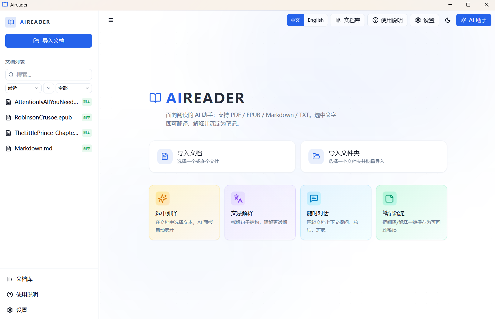

<div align="center">


# Aireader

### Your Documents. Your GPU. Your Knowledge.

**AI-powered reading assistant that runs 100% on your machine**

[](LICENSE)
[](https://tauri.app)
[](https://github.com/ggerganov/llama.cpp)
[]()

**[English](README_EN.md)** · **[中文](README_CN.md)** · **[User Guide](USER_GUIDE_EN.md)** · **[用户指南](USER_GUIDE_CN.md)**

</div>

---

> Most AI reading tools send your documents to the cloud. **Aireader doesn't.**
>
> Built-in llama.cpp engine. AI runs on your CPU/GPU. Data never leaves your machine.

<div align="center">



</div>

## ✨ Highlights

- **🔒 100% Offline** — Zero cloud dependency. Your documents stay on your machine.
- **⚡ Smart Hardware Matching** — Auto-detects GPU → benchmarks all backends (CUDA / Vulkan / Metal / CPU) → picks the fastest → you choose the model.
- **📖 Reading-First** — Not a chatbot. A real AI assistant for deep reading: select text → translate → explain → save notes.
- **🌐 Flexible AI Backends** — Built-in Qwen3 (0.6B–32B), or connect Ollama / OpenAI-compatible APIs.
- **📚 Offline Dictionaries** — Built-in ECDICT + CC-CEDICT. Double-click any word.

## �️ Supported Platforms

| Platform | GPU Acceleration |
|:---|:---|
| **Windows x64** | CUDA 12.4/13.1 · Vulkan · CPU |
| **macOS arm64** | Metal (CPU+GPU unified) |
| **macOS x64** | CPU |
| **Ubuntu x64** | Vulkan · CPU |

## 🚀 Quick Start

```bash
npm install          # Install dependencies
npm run tauri dev    # Development mode
npm run tauri build  # Build for production
```

**First launch** → Setup wizard → Language → Storage paths → Multi-engine benchmark → Choose model → Start reading.

## 🏗️ Tech Stack

| Layer | Technology |
|:---|:---|
| Frontend | React 18 · TypeScript · TailwindCSS · Zustand |
| Desktop | Tauri 2.0 (Rust) |
| AI Engine | llama.cpp b7966 · llama-bench · Qwen3 0.6B–32B (Q4_K_M) |
| Rendering | react-pdf / pdf.js · epub.js · react-markdown |
| Storage | SQLite (rusqlite) · localStorage |
| Dictionary | [ECDICT](https://github.com/skywind3000/ECDICT) · [CC-CEDICT](https://cc-cedict.org/) |

<details>
<summary><b>📁 Project Structure</b></summary>

```
aireader/
├── src/                        # React frontend
│   ├── components/
│   │   ├── ai/                 # AI panel & contextual chat
│   │   ├── help/               # Help modal
│   │   ├── layout/             # Sidebar, welcome, document library
│   │   ├── notes/              # Notes panel
│   │   ├── reader/             # PDF / EPUB / TXT / MD readers
│   │   ├── settings/           # Settings modal
│   │   ├── setup/              # First-launch setup wizard
│   │   └── ui/                 # Shared UI & dictionary popup
│   ├── config/                 # Download URLs & model tiers
│   ├── i18n/                   # Internationalization (CN/EN)
│   ├── services/               # Ollama API & streaming
│   ├── stores/                 # Zustand state management
│   └── types/                  # TypeScript type definitions
├── src-tauri/                  # Rust backend
│   ├── src/
│   │   ├── lib.rs              # Tauri commands & app config
│   │   ├── builtin_llm.rs      # llama.cpp integration & model management
│   │   ├── database.rs         # SQLite note storage
│   │   ├── dictionary.rs       # ECDICT / CC-CEDICT dictionary
│   │   ├── epub.rs             # EPUB extraction
│   │   └── ollama.rs           # Ollama proxy
│   ├── resources/              # Dictionaries & sample documents
│   └── Cargo.toml
└── package.json
```

</details>

## 🙏 Acknowledgments

- [llama.cpp](https://github.com/ggerganov/llama.cpp) — Local LLM inference engine
- [Tauri](https://tauri.app) — Desktop application framework
- [Qwen3](https://github.com/QwenLM/Qwen3) — Built-in language models
- [ECDICT](https://github.com/skywind3000/ECDICT) — Offline English-Chinese dictionary
- [CC-CEDICT](https://cc-cedict.org/) — Offline Chinese-English dictionary

## 📄 License

[MIT](LICENSE) © xujiayu
