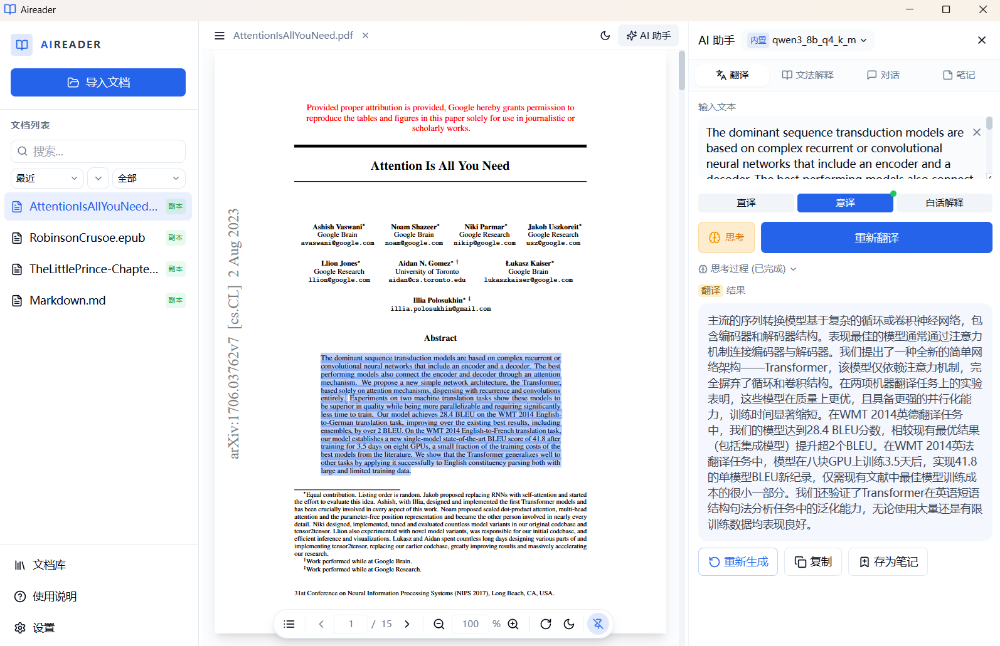
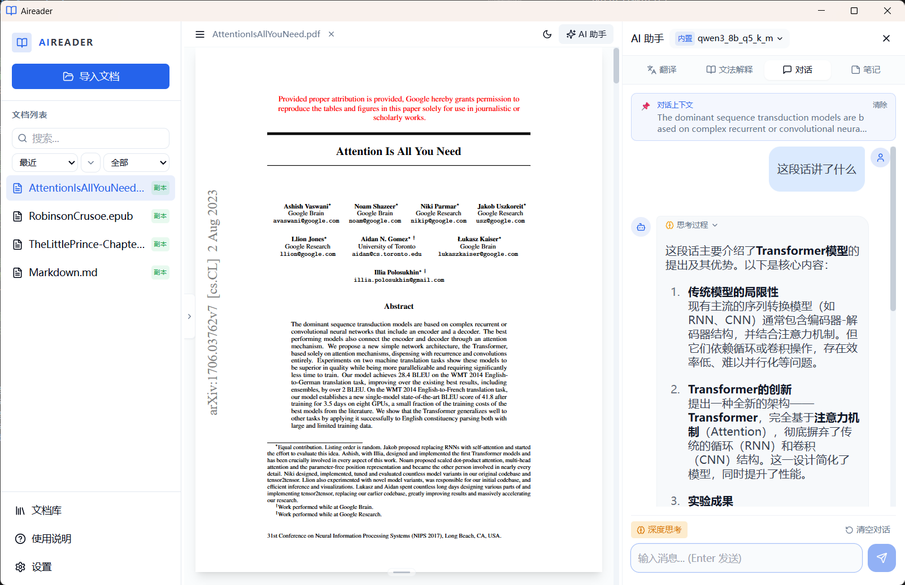
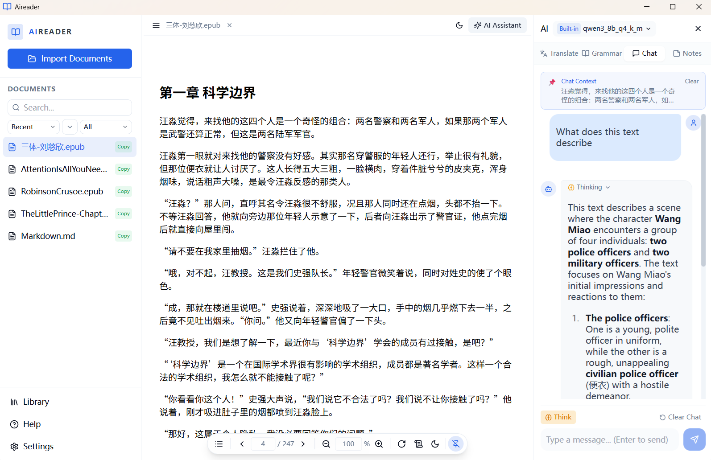
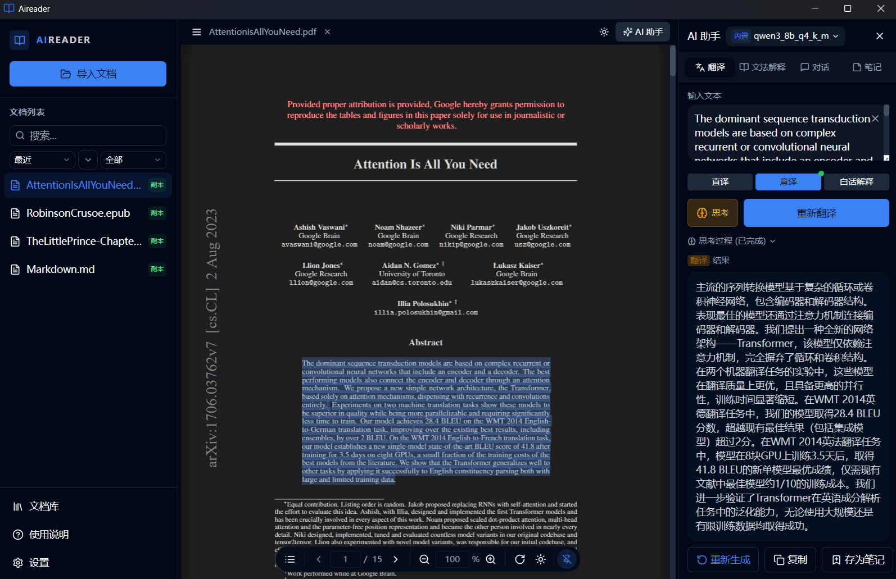
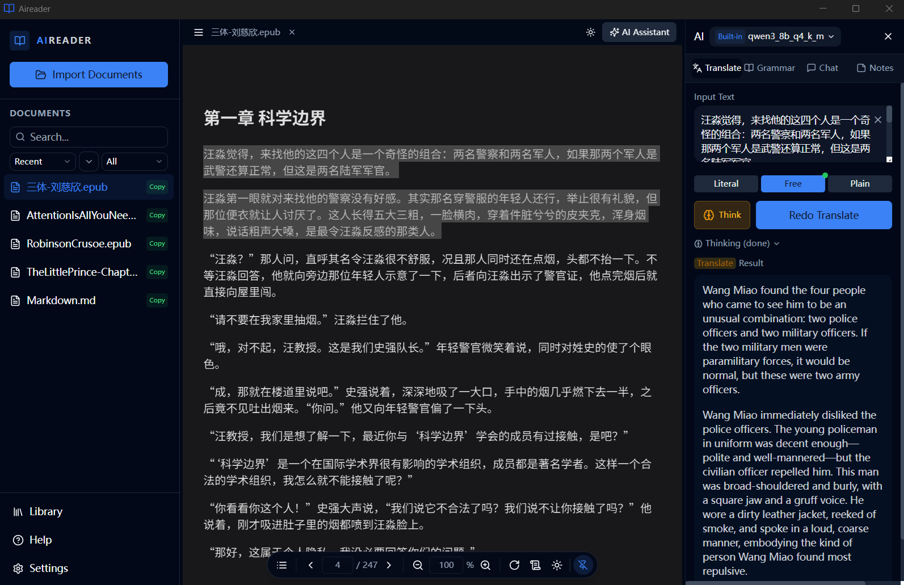
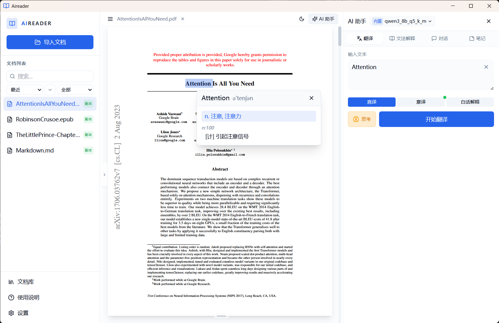
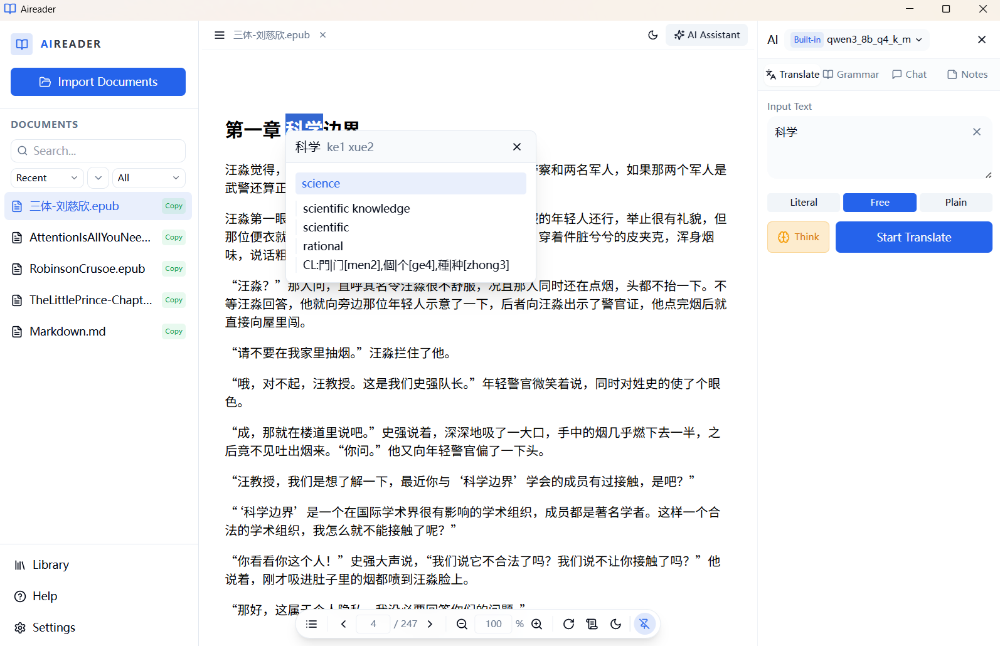
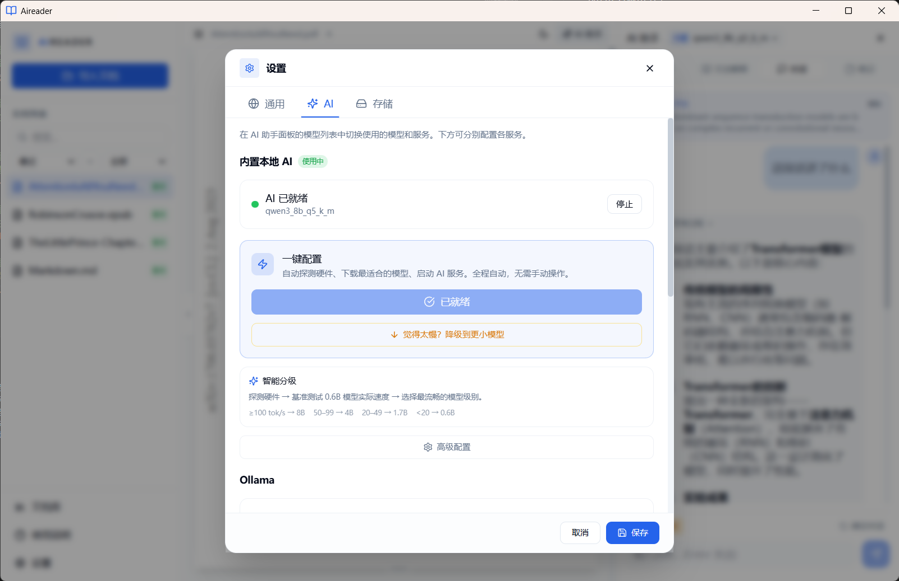
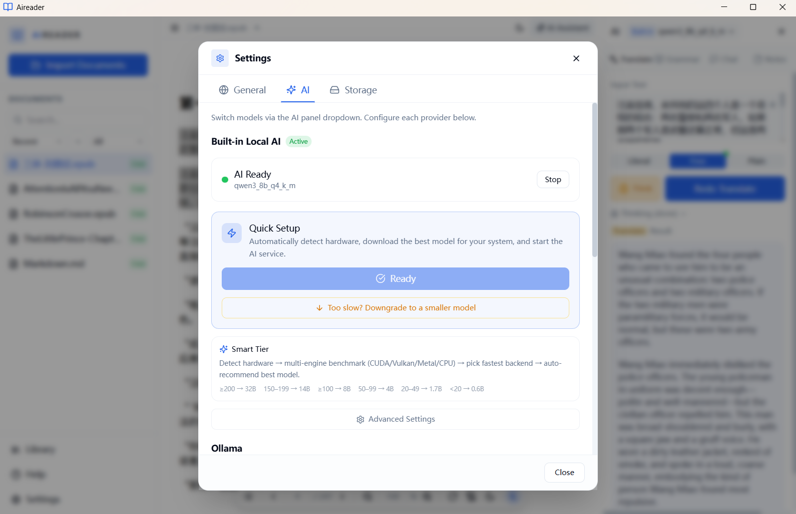

<div align="center">


# Aireader

### 让你的算力为你服务

**完全离线的 AI 阅读助手 — 翻译、解释、对话、笔记，一切在本地完成**

[](LICENSE)
[](https://tauri.app)
[](https://github.com/ggml-org/llama.cpp)
[]()

**[English](docs/README_EN.md)** · **[用户指南](docs/USER_GUIDE_CN.md)** · **[User Guide](docs/USER_GUIDE_EN.md)**

</div>

---

> 大多数 AI 阅读工具把你的文档发送到云端。**Aireader 不会。**
>
> 内置 llama.cpp 推理引擎，AI 在你的 CPU/GPU 上运行，数据永远不会离开你的电脑。

## 📸 界面预览

| 主界面 | 选中翻译 |
|:---:|:---:|
|  |  |

<details>
<summary><b>更多截图</b></summary>

| 功能 | 中文 | English |
|:---|:---:|:---:|
| AI 对话 |  |  |
| 深色主题 |  |  |
| 词典弹窗 |  |  |
| 快速配置 |  |  |

</details>

## ✨ 核心特性

- **🔒 完全离线** — 零云端依赖，文档数据只在你的电脑上
- **⚡ 智能硬件适配** — 自动检测 GPU → 跑分所有后端 (CUDA / Vulkan / Metal / CPU) → 选最快的 → 你选模型
- **📖 为阅读而生** — 不是聊天机器人，是真正的阅读 AI 助手：选中文本 → 翻译 → 解释 → 保存笔记
- **🌐 灵活的 AI 后端** — 内置 Qwen3 (0.6B–32B)，也可连接 Ollama / OpenAI 兼容 API
- **📚 离线词典** — 内置 ECDICT + CC-CEDICT，双击查词
- **🌗 明暗主题** — 支持浅色/深色/跟随系统

## 🖥️ 支持平台

| 平台 | GPU 加速 |
|:---|:---|
| **Windows x64** | CUDA 12.4/13.1 · Vulkan · CPU |
| **macOS arm64** | Metal (CPU+GPU 统一内存) |
| **macOS x64** | CPU |
| **Ubuntu x64** | Vulkan · CPU |

## 🚀 快速开始

```bash
npm install          # 安装依赖
npm run tauri dev    # 开发模式
npm run tauri build  # 构建发布版
```

**首次启动** → 引导向导 → 选择语言 → 设置存储路径 → 多引擎跑分 → 选择模型 → 开始阅读

## 🏗️ 技术栈

| 层级 | 技术 |
|:---|:---|
| 前端 | React 18 · TypeScript · TailwindCSS · Zustand |
| 桌面 | Tauri 2.0 (Rust) |
| AI 引擎 | llama.cpp b7966 · llama-bench · Qwen3 0.6B–32B (Q4_K_M) |
| 文档渲染 | react-pdf / pdf.js · epub.js · react-markdown |
| 存储 | SQLite (rusqlite) · localStorage |
| 词典 | [ECDICT](https://github.com/skywind3000/ECDICT) · [CC-CEDICT](https://cc-cedict.org/) |

<details>
<summary><b>📁 项目结构</b></summary>

```
aireader/
├── src/                        # React 前端
│   ├── components/
│   │   ├── ai/                 # AI 面板 & 上下文对话
│   │   ├── layout/             # 侧边栏、欢迎页、文档库
│   │   ├── reader/             # PDF / EPUB / TXT / MD 阅读器
│   │   ├── settings/           # 设置面板
│   │   ├── setup/              # 首次启动引导向导
│   │   └── ui/                 # 通用 UI 组件 & 词典弹窗
│   ├── config/                 # 下载链接 & 模型定义
│   ├── services/               # Ollama API & 流式输出
│   ├── stores/                 # Zustand 状态管理
│   └── types/                  # TypeScript 类型定义
├── src-tauri/                  # Rust 后端
│   ├── src/
│   │   ├── lib.rs              # Tauri 命令 & 应用配置
│   │   ├── builtin_llm.rs      # llama.cpp 集成 & 模型管理
│   │   ├── database.rs         # SQLite 笔记存储
│   │   ├── dictionary.rs       # ECDICT / CC-CEDICT 词典
│   │   ├── epub.rs             # EPUB 解析
│   │   └── ollama.rs           # Ollama 代理
│   ├── resources/              # 词典 & 示例文档
│   └── Cargo.toml
├── docs/                       # 文档
│   ├── README_EN.md            # English README
│   ├── USER_GUIDE.md           # 用户指南 (双语合并版)
│   ├── USER_GUIDE_CN.md        # 用户指南 (中文)
│   └── USER_GUIDE_EN.md        # User Guide (English)
├── screenshots/                # 截图
└── package.json
```

</details>

## 🙏 致谢

- [llama.cpp](https://github.com/ggml-org/llama.cpp) — 本地 LLM 推理引擎
- [Tauri](https://tauri.app) — 桌面应用框架
- [Qwen3](https://github.com/QwenLM/Qwen3) — 内置语言模型
- [ECDICT](https://github.com/skywind3000/ECDICT) — 离线英汉词典
- [CC-CEDICT](https://cc-cedict.org/) — 离线汉英词典

## 📄 许可证

[MIT](LICENSE) © xujiayu
