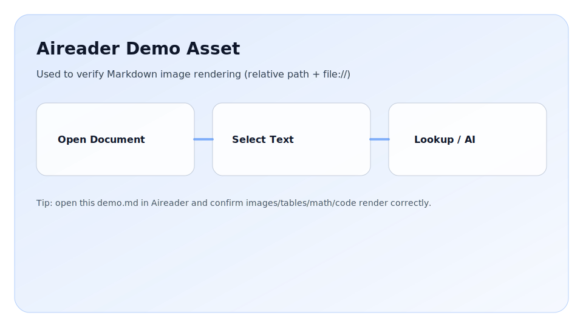

# Aireader Markdown Rendering Demo

这一份文件用于测试 **图片 / 表格 / 公式 / 代码 / 引用 / 列表 / 任务清单** 等渲染效果。

## 1) 图片

相对路径图片（同目录 assets）：



## 2) 表格（GFM）

| Feature | Status | Notes |
|---|---:|---|
| Images | OK | relative path + file:// |
| Tables | OK | GFM table |
| Math | OK | KaTeX |
| Code | OK | highlight.js |

## 3) 公式（KaTeX）

行内公式：$E = mc^2$。

块级公式：

$$
\int_{0}^{\infty} e^{-x^2} dx = \frac{\sqrt{\pi}}{2}
$$

矩阵：

$$
A = \begin{bmatrix}
1 & 2 \\
3 & 4
\end{bmatrix}
$$

## 4) 代码（高亮）

```ts
type DictionaryResult = {
  word: string;
  translation?: string;
};

export function normalizeWord(input: string) {
  return input.trim().toLowerCase();
}
```

```rust
fn unique_dest_path(dir: &std::path::Path, file_name: &str) -> std::path::PathBuf {
    dir.join(file_name)
}
```

## 5) 引用 / 列表 / 任务清单

> 这是一段引用，用来测试 blockquote 的样式。

- 第一条
- 第二条
  - 子项 A
  - 子项 B

1. 有序列表 1
2. 有序列表 2

任务：

- [x] 渲染图片
- [x] 渲染表格
- [x] 渲染公式
- [x] 渲染代码

## 6) 删除线 / 粗体 / 斜体

~~删除线~~、**粗体**、*斜体*。
